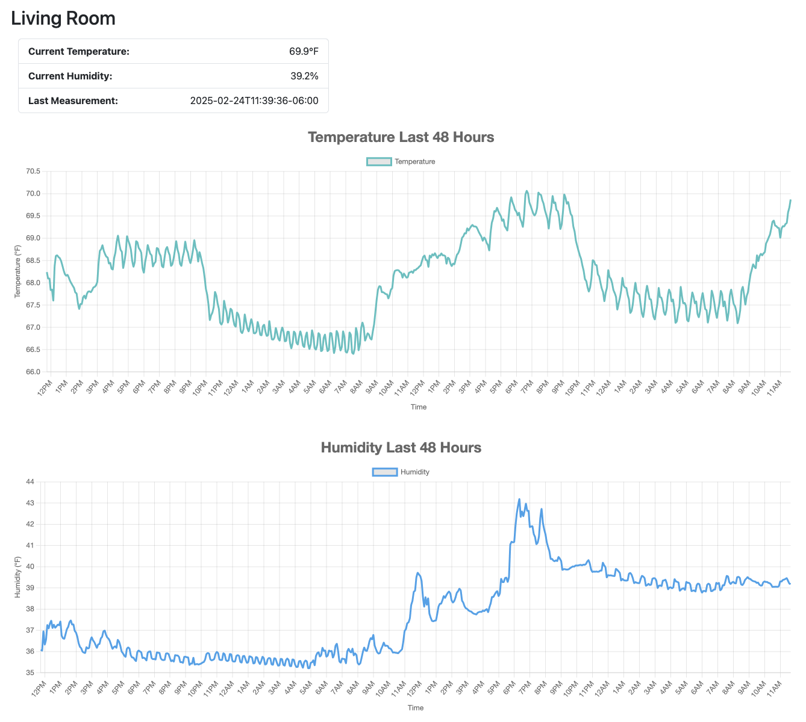

# Home Automation Project

Implementation to create client and server binaries to run on raspberry pi and read climate sensors. Also the climate is displayed on server web page. Example snapshot:



## SHTC3 High-Precision Digital Temperature and Humidity Sensor

The SHTC3 is a compact, low-power sensor for precise temperature and humidity readings. It supports I2C communication and operates within a voltage range of 1.62V to 3.6V.

Key Features:
Temperature Range: -40°C to 125°C

Humidity Range: 0% to 100% RH

Accuracy: ±0.2°C (temperature), ±2% RH (humidity)

Purchase:
Available on [Amazon](https://a.co/d/fzAEyVL) and other online retailers.

### systemd Service

File name: /etc/systemd/system/dht-client.service

Use the IP address is sending from raspberry pi.

```sh
[Unit]
Description=Client to record temperature and humidity
After=network.target

[Service]
Type=simple
User=tony
ExecStart=/home/tony/home-auto-client/client  --room-id=4 --interval=300 --host="<IP address:port number>"
Restart=on-failure

[Install]
WantedBy=multi-user.target

```

Then run systemd commands:

```sh
sudo chmod 644 /etc/systemd/system/dht-client.service
sudo systemctl daemon-reload
sudo systemctl enable dht-client.service
sudo systemctl start dht-client.service
sudo systemctl status dht-client.service

sudo systemctl start dht-server.service
sudo systemctl status dht-server.service
```
